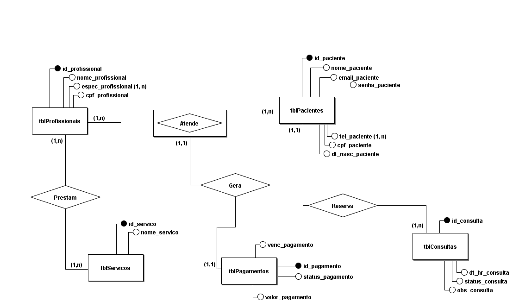

#   Backend - Sistema de uma Clínica
[](https://github.com/mgl-uhou/backend-clinica/blob/main/LICENSE)

# Sobre o Projeto
Backend feito para um projeto a parte do curso de Desenvolvimento de Sistemas - IFAL, 2º ano.

Esse projeto visa o uso de tecnologias do mercado e a aplicação dos conhecimentos para construir um backend utilizando conceitos, como POO, Programação Funcional e Organização MVC.

É possível ver a criação de diversas rotas que servem para a manipulação e utilização das tabelas do Banco de Dados.

## Tecnologias
- NodeJS
- MySQL
- Express

# Modelo Conceitual


# Como Executar o Projeto
**Pré requisitos**: NodeJS e Servidor local para o MySQL.

1. Faça um clone do projeto executando o seguinte comando em bash:.
  ```bash
  git clone https://github.com/mgl-uhou/backend-clinica.git
  ```
2. Inicie um servidor para o banco de dados se conectar. Ex.: WampServer ou XAMPP,
3. Na pasta raiz do projeto, localize o arquivo `.env.example` e renomeie ele para apenas `.env`.
4. Preencha as variáveis do arquivo com os valores necessários, conforme a sua máquina:
   - `port`: É a porta que o servidor Express vai usar.
   - `mysql_host`: É o endereço do host do servidor MySQL.
   - `mysql_user`: O nome do seu usuário do MySQL.
   - `mysql_pass`: A senha do seu usuário do MySQL.
   - `mysql_db`: O nome que você quer no banco de dados que será criado na sua máquina.
5. Com o `.env` salvo, abra o terminal na pasta raiz do projeto.
6. Digite no terminal:
   ```powershell
   npm install
   ```
7. Depois de instalado todas as dependências, execute no terminal o comando:
   ```powershell
   npm run dev
   ```

Com isso, a API já pode ser testada utilizando algum software terceiro, como por exemplo o ReqBin, Insomnia ou Postman.

> Miguel Ferreira
